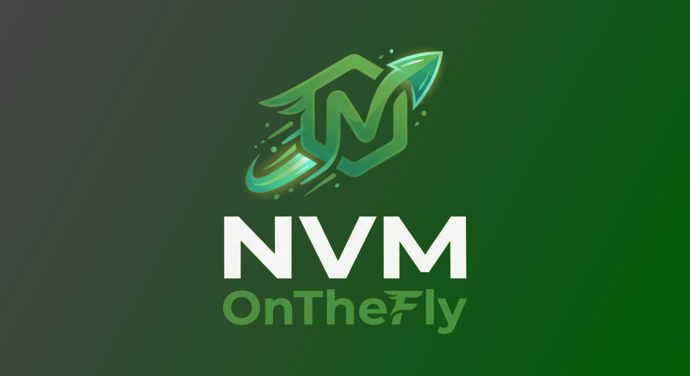
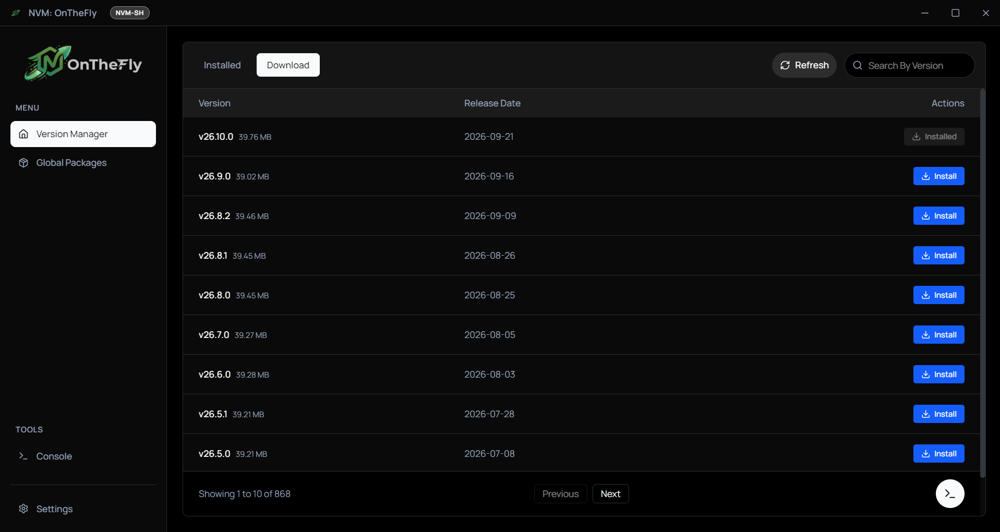
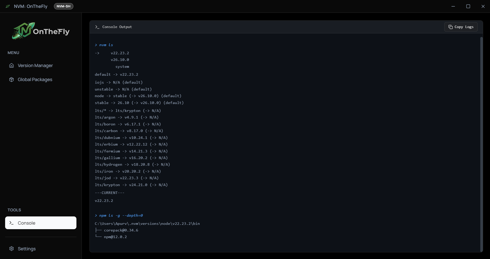
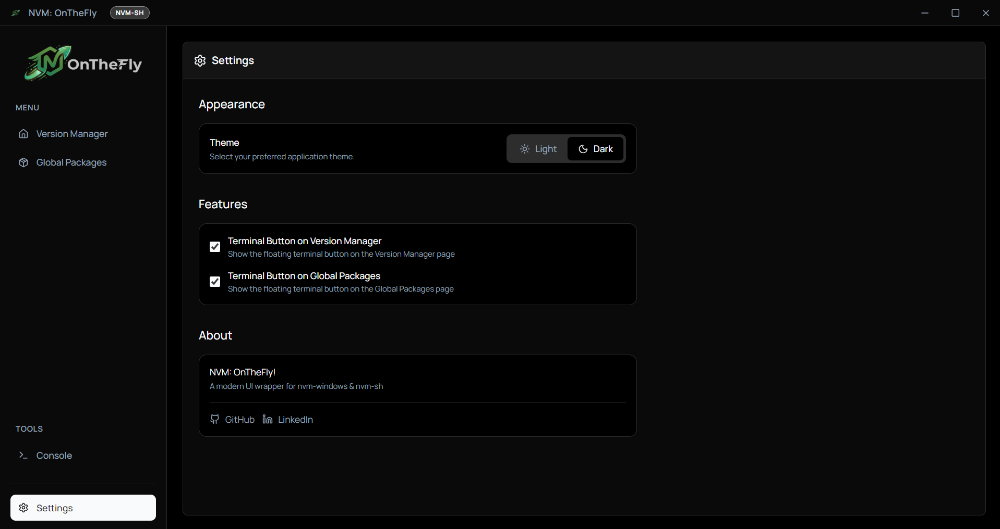

  

# NVM: OnTheFly!

A GUI for managing Node Version Manager (NVM) environments NATIVELY

> [!IMPORTANT]
> This application does **not** act like a regular standalone manager that creates its own isolated folders, symlinks, or custom configuration files. Instead, it acts as a direct GUI wrapper that **hooks natively into your existing `nvm-sh` and `nvm-windows` installations**. Any change you make in the GUI is exactly what would happen if you typed it in the terminal, meaning zero lock-in and 100% compatibility with your current setup!

## Demo

  <video src="./assets/NVM-OTF.mp4" controls="controls" width="100%">
  </video>

## Screenshots

## Features & Abilities

- **Project Auto-Detection**: Drag and drop a project directory (or use the file picker) to parse its `package.json`. The app instantly analyzes the required Node.js version, lists all dependencies (with sizes and versions), and provides one-click actions to switch to or install the exact Node version your project needs.
- **Visual Node Version Management**: View your installed Node.js versions and all available remote versions to download, directly from an intuitive UI table.
- **Install, Uninstall & Batch Operations**: Quickly install new Node versions or remove old ones with one click. Select multiple installed versions to efficiently batch-uninstall them via a sleek floating action bar. Uninstallations are protected by a confirmation prompt.
- **Cancelable Operations**: Safely abort ongoing Node.js installations at any time with a dedicated cancel action.
- **Set Active Version**: Easily switch your system's default Node.js version by clicking the "Use" button.
- **Smart Search**: Quickly find specific Node versions out of hundreds of releases using the built-in search filter.
- **Storage Insights**: Automatically calculates and displays the disk space occupied by your installed Node versions and the file sizes of remote versions, as well as the individual and combined sizes of all your global NPM packages.
- **Lightning Fast Optimistic UI**: Uses intelligent command stream parsing to instantly update the local state during installs or uninstalls, entirely bypassing slow redundant shell polling to keep the application buttery smooth.
- **Global Package Migration**: When installing a new Node version, the GUI allows you to seamlessly migrate globally installed NPM packages from an older installed version. You can either migrate all packages at once, or selectively choose specific packages to migrate.
- **Global Package Manager**: Instantly list all global packages installed on the current default Node version, and easily uninstall unwanted packages with one click. Check for outdated packages, update them individually, and clean your npm cache directly from the UI.
- **NVM Alias Management**: Create, view, and delete handy shortcut aliases for your Node.js versions (e.g., `prod` -> `18.17.0`) via a dedicated Aliases tab (native to `nvm-sh`).
- **Dual NVM Engine Support**: Automatically detects `nvm-windows` installations, with a fallback to `nvm-sh` (via Git Bash). The UI allows you to hot-swap between these CLI interfaces if both are installed.
- **Interactive Terminal Console**: Features a slide-up terminal console that not only streams real-time `stdout` and `stderr` from background tasks, but also allows you to manually type and execute arbitrary system or `nvm` commands seamlessly across different engine modes.
- **Adaptive Theming**: Fully responsive Dark and Light modes that can be manually toggled via the settings drawer, dynamically styling the app and logos.

---

### Currently known bugs:

none
